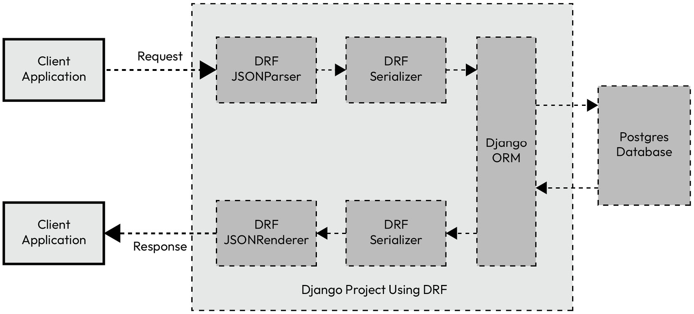

# Serializer
```
The client application generally uses the JSON data format to send information to the server. DRF uses JSONParser by default to parse the data from the JSON format to Python native format. Finally the Python native format data would be passed to JSONRenderer to render the data into the JSON format and sent to the client
```



```
# blog/models.py
class Blog(BaseTimeStampModel):
    title = models.CharField(max_length=200)
    content = models.TextField()
    author = models.ForeignKey(Author, related_name='author_blogs', on_delete=models.PROTECT)

# blog/serializers.py
class BlogSerializer(serializers.ModelSerializer):
    class Meta:
        model = Blog
        fields = '__all__'
```

## Signals
Signals provide a way to respond to actions occuring within an application. They allow tasks like logging, cache invalidation to execute without tightly coupling the code. It follows the publish-subscribe pattern, where sender broadcasts an event and recievers handle it.

```
from django.db.models.signals import post_save
from django.dispatch import receiver
from myapp.models import CustomUser

@receiver(post_save, sender=CustomUser)
def create_profile(sender, instance, created, **kwargs):
    if created:
        print(f'Profile created for {instance.username}')

```

```
from django.db import models
from django.contrib.auth.models import User
from PIL import Image


class Profile(models.Model):
    user = models.OneToOneField(User, on_delete=models.CASCADE)
    image = models.ImageField(default='default.jpg', upload_to='profile_pics')

    def __str__(self):
        return f'{self.user.username} Profile'

from django.db.models.signals import post_save, pre_delete
from django.contrib.auth.models import User
from django.dispatch import receiver
from .models import Profile


@receiver(post_save, sender=User) 
def create_profile(sender, instance, created, **kwargs):
    if created:
        Profile.objects.create(user=instance)
 
@receiver(post_save, sender=User) 
def save_profile(sender, instance, **kwargs):
        instance.profile.save()     
```


## F()
It is a powerful tool used to perform database operation at the database level. It allows you to reference the value of a field directly in your query.
```
from django.db import models

class Product(models.Model):
    name = models.CharFiled(max_length=100)
    price = models.DecimalField(max_digits=10, decimal_places=2)

from django.db.models import F
Product.objects.update(price=F('price') * 1.10)
```

## Q()
It is used to write complex database queries with logical operators like OR(|), AND(&), and NOT(~).
```
from django.models import Q

p = Person.objects.filter(Q(name='Alice') | Q(age=30))
```

## prefetch_related
It is a performance optimization method in Django's QuerySet API
```
N+1 Query Issue

books = book.objects.all()

for book in books:
    print([author.name for author in book.authors.all()])

```
Using prefetch_related
```
books = Book.objects.prefetch_related('authors').all()

for book in books:
    print([author.name for author in book.authors.all()])
```


