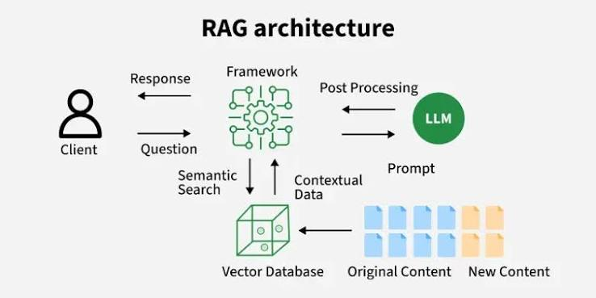

### Why need RAG?
- Everything LLM "knows" was encoded into its weights during training and then frozen (training cutoff) - <b>Parametric memory</b>.
- Private data relevant to an organization is not in public domain, hence an LLM cannot access it for accurate queries.
- <b>Citation</b> is possible when we provide local documents (with citation like source URL saved) to an LLM and so result can be trusted.


### What is RAG?
It is Retreival-Augmented Generation, a technique of augmenting a language model's generation with context that is retreived at query time from an external knowledge source, rather than relying on model's parametric memory.


### RAG vs Fine Tuning
Fine-tuning changes weight, so it learns a new skill, style or format like answering in a company's specific support-ticket voice. RAG changes the context, supplies fresh facts before inferce for grounded response.


### RAG Pipeline
- Indexing, sometimes called the build or offline phase. We take our documents, process them into vectors, and load them into a searchable index. 

- Retreival and generation - Query or online phase. We take the embedded user query, search the index for relevant chunks, insert these along with a prompt message (augmentation) and send to the LLM for an answer.


### Stage 1 - Ingest: turn raw sources into clean text
Ingestion parses each source into plain text plus metadata, such as source filename, page number, a URL, etc. The metadata helps in citation.


### Stage 2 - Chunk: cut documents into retreival units
A chunk serves as an atomic unit of retreival. The documents are broken into these chunks using some chunking criteria. We usually include and overlap between neighbouring chunks so that an idea crossing a boundary is not left out.


### Stage 3 - Embed: turn each chunk into a vector
An embedding model reads a chunk and emits a fixed-length dense vector of a fixed dimension (like a 1,536 dimensional vector of floating numbers)


### Stage 4 - Index: store vectors so you can search them fast
Vectors saved in some vector database like Pincone, FAISS for faster retreival.


### Stage 5 - Retreive: embed the query, pull the top-k
The embedded query is used to pull up the top-k chunks who are sematically closest to it using cosine similarity.


### Stage 6 - Augmentation: Assemble the prompt
Example prompt which combines the user query with the retreived chunks
```
System: Answer ONLY using the context below. If the answer is
not in the context, say "I don't know." Cite the source id.

Context:
[D1 | source: wiki] The Model X battery lasts 400 kilometres on a full charge.

Question: how far can the car go?
```


### Stage 7 - Generation: the grounded answer
The assembled promt goes to a generation model to get the appropriate response
